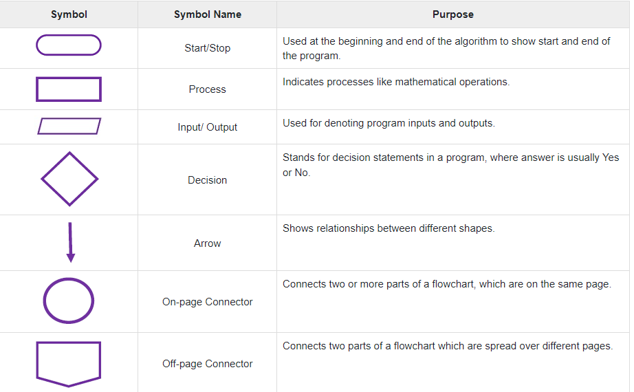
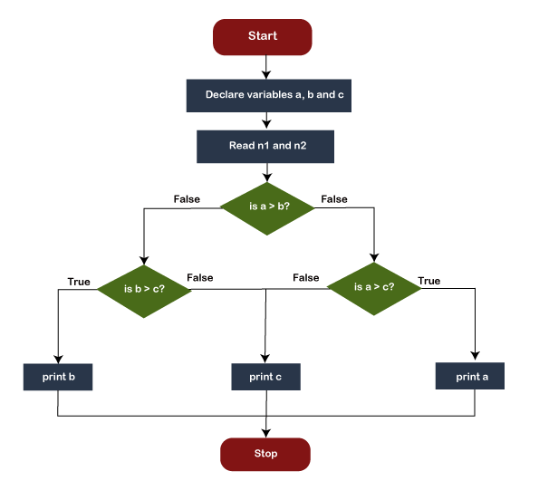
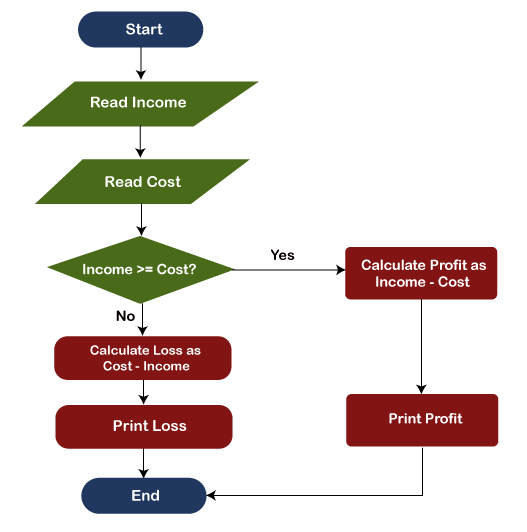
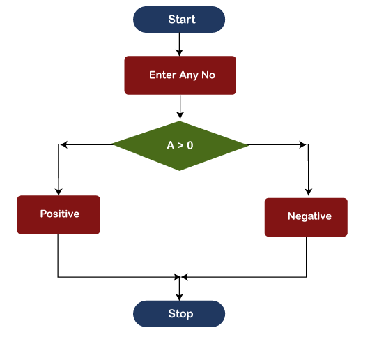

# **Introduction, Flow Charts, PseudoCode, Programming and Why**
*In this video, We would learn about what is flow chart & what is pseudocode. What is use of programming amd why to do programming?*

*Check it out for detailed explanation:* [Video Link](https://www.youtube.com/watch?v=WQoB2z67hvY&list=PLDzeHZWIZsTryvtXdMr6rPh4IDexB5NIA)

## **FlowChart**
*The Flowchart is the most widely used graphical representation of an algorithm and procedural design workflows. It uses simple geometric shapes to depict processes and arrows to show relationships and process/data flow.*

#### **Flowchart Symbols**

#### **Examples**
*Design a flowchart for finding the largest among three numbers entered by the user.*

*Design a flowchart for calculating the profit and loss according to the value entered by the user.*

*Design a flowchart for checking whether the number is positive or negative according to the number entered by the user.*

## **PseudoCode**
*It is written in the form of annotations and informational text that is written in plain English only. Just like programming languages, it doesn't have any syntax, so it cannot be compiled or interpreted by the compiler.*

#### **Examples**
*PseudoCode to check number is Armstrong or not.*

  - *Initialize c to zero.*
  - *Initialize n to a random number to check Armstrong.*
  - *Initialize temp to n.*
  - *Repeat steps until the value of n are greater than zero.*
  - *Find a reminder of n by using n%10.*
  - *Remove the last digit from the number by using n/10.*
  - *Find the thrice of the reminder and add it to c.*
  - *If temp == c*
      - *Print "Armstrong number"*
  - *else*
      - *Print "Not an Armstrong number"*

## **Programming Language**
*A programming language is a computer language that is used by programmers (developers) to communicate with computers. It is a set of instructions written in any specific language ( C, C++, Java, Python) to perform a specific task. We can also say that it is vocabulary and a collection of rules that command a computer, devices, applications to work according to the written codes.*

#### **Here are Several Features That Explain Why Programming Languages are Needed**
  - *To advance your ability to develop real algorithms- Most of the languages come with a lot of features for the Programmers. They can be used in a proper way to get the best results.*
  - *To Improve Customization of Your Current Coding- By using basic features of the existing programming language you can simplify things to program a better option to write resourceful codes. There is no compulsion of writing code in a specific way. The thing which matters is the usage of features used and clarity of the concept.*
  - *To Increase Your Vocabulary Of beneficial Programming Constructs- Programmers use high-level languages to express thoughts. And, by using the best features they can easily explain the working of a specific application, device, etc.*

